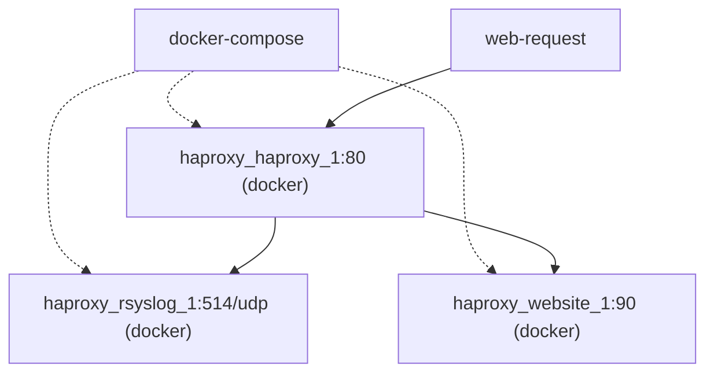

# Table of content

- [What is HAProxy](what-is-haproxy)
- [Map](maps)
- [Configuration file](configuration-file)
- [HAProxy and rsyslog](haroxy-and-rsyslog)

## What is HAProxy

- A TCP/HTTP proxy
- A SSL off-loader
- A TCP/HTTP normalizer that detect flaws in traffic
- An HTTP modifier
- A load-balancer
- A traffic-regulator
- A protection against DDoS
- A caching proxy
- A FastCGI gateway

## How HAProxy works

- Event-driven, non-blocking
- Fast I/O
- Multi-threaded scheduler

HAProxy runs fine on one CPU but it can run in a multi-threaded fashion allowing a better usage os system resources.

It relies a lot on the Kernel and try as most as possible to have an affinity between CPU core and connections to avoid data / memory copy and bottlenecks.

Its inner design is splited into two part: the front-end and the back- end.
- HAProxy is constantly listening to incoming requests on the front-end side.
- Then it routes the traffic to the back-end. When a reponse is available, it flows back to the front-end.

During this process, HAProxy will apply any transformation / routing that has been configured downward and upward.

## Maps

👉 2 colums files loaded at startup for ah-hoc data in requests

## Configuration file

```
global
    # global settings here

defaults
    # defaults here

frontend
    # a frontend that accepts requests from clients

backend
    # servers that fulfill the requests
```

## HAProxy and rsyslog

In this proof of concept, we are aiming to send HTTP requests to a web-site. The web-site is listening on port 90/tcp and is declared as a backend server in HAProxy. HAProxy is listening on port 80/tcp and forward request to our .NET Core web site. Also, HTTP requests are logged using a remote rsyslog using port 514/udp.



Below is the structure of the POC. We will use docker-compose to build and run eveything.

```
haproxy
    /website
        - Dockerfile
        - **.csproj;**.cs
        /wwwroot
            - index.html
    /haproxy
        - Dockerfile
        - haproxy.cfg        
    /rsyslog
        - Dockerfile
        - haproxy.conf        
```


The .NET Core application is a simple web application serving static files. It has been initialized with the .net CLI `dotnet new web` under the website directory.

The only changed made are in `haproxy/website/Startup.cs`
```csharp
public class Startup
{
    public void Configure(IApplicationBuilder app, IWebHostEnvironment env)
    {
        // use default files
        app.UseDefaultFiles();
        // serve static files in wwwroot
        app.UseStaticFiles();
    }
}
```

And below is the corresponding Dockerfile:

```dockerfile
# Use latest microsoft SDK
FROM mcr.microsoft.com/dotnet/sdk AS build
# Publish the app from source code
WORKDIR /src
COPY . .
RUN dotnet publish -c Release -o /build/output
# Use latest microsoft .NET runtime
FROM mcr.microsoft.com/dotnet/aspnet AS runtime
# Copy published app from previous stage
COPY --from=build /build/output /app
WORKDIR /app
# Expose 90/tcp port
EXPOSE 90
# Execute web server
ENTRYPOINT [ "dotnet", "website.dll" ]
```

You can test the application locally:
```
dotnet run
````

Or using docker CLI:
```
docker build -t my-website .
docker run -it --rm --name my-website -e ASPNETCORE_URLS=http://+:90 -p 90:90 my-website
```

Now let's configure HAProxy using the following configuration file:

`haproxy/haproxy/haproxy.cfg`
```yaml
global
    # configure global logging using remote rsyslog
    # we log "user" logs using the local0 facility
    # see https://wiki.gentoo.org/wiki/Rsyslog#Facility
    # and we set the debug level to observe everything
    # see https://wiki.gentoo.org/wiki/Rsyslog#Severity
    log haproxy_rsyslog_1:514 local0 debug

    # NB : haproxy_rsyslog_1 is the hostname of the 
    # rsyslog container in the docker network that docker-compose
    # will setup for us

defaults
    # by default, we operate http traffic
    mode    http
    # by default, we log relying on global configuration
    log     global
    # by default, we activate http log information
    option  httplog
    timeout connect 5s
    timeout client  50s
    timeout server  50s

# this is our front-end, the "listening" side of HAProxy
frontend my-website-frontend
    # listen on port 80/tcp
    bind 0.0.0.0:80
    # forward all request to our backend
    default_backend my-website-backend

# this is our back-end, where we forward requests
backend my-website-backend
    # we redirect all traffic to haproxy_web_1:90/tcp
    server server1 haproxy_web_1:90
```

And use the following `haproxy/haproxy/Dockerfile`:
```
# HAProxy base image
FROM haproxy:2.3

# Feed ad-hoc configuration directory of HAProxy
COPY haproxy.cfg /usr/local/etc/haproxy/haproxy.cfg
```

Let's configure our logging stack using rsyslog:

`haproxy/rsyslog/haproxy.conf`
```yaml
# Collect log with UDP
$ModLoad imudp
# Bind all IP Address on port 514/udp
$UDPServerAddress 0.0.0.0
$UDPServerRun 514

# User logs goes to traffic.log file
local0.* /var/log/haproxy/traffic.log
```

`haproxy/rsyslog/Dockerfile`
```dockerfile
# Use ubuntu as base image
FROM ubuntu
# Install rsyslog
RUN apt update
RUN apt install rsyslog -y
# Feed rsyslog with our ad-hoc config file
ADD haproxy.conf /etc/rsyslog.d/haproxy.conf
# Declare a volume to be mount to see the logs from the host OS
VOLUME /var/log/haproxy
# Expose the port 514/udp to receive logs
EXPOSE 514/udp
# Start rsyslog
ENTRYPOINT ["rsyslogd", "-n"]
```

Finally, we orchestrate everything using this docker-compose file:

`haproxy/docker-compose.yml`:
```yaml
version: "3.9"
services: 
  # declare our web service
  web:
    # build using haproxy/website/Dockerfile
    build: ./website
    # declare port binding. Equivalent of "-p 90:90"
    ports:
      - 90:90
    # set some env variables
    environment:
      - ASPNETCORE_URLS=http://+:90
      - ASPNETCORE_ENVIRONEMENT=Development
  
  # this is our logging stacj
  rsyslog:
    # build using haproxy/rsyslog/Dockerfile
    build: ./rsyslog
    # mount local logs directory to actually be able to read the log file
    volumes: 
      - "./logs:/var/log/haproxy"
    # expose port 514/udp
    ports:
      - 514:514/udp
    cap_add:
      - SYSLOG
  
  # finally haproxy
  haproxy:
    depends_on:
      - web
      - rsyslog
    # build using haproxy/haproxy/Dockerfile
    build: ./haproxy
    # exposer port 80/tcp
    ports:
      - 80:80
```

Run everything:
```powershell
docker-compose build ; docker-compose up
```

```
Building web...
Building rsyslog...
Building haproxy...
Recreating haproxy_rsyslog_1 ... done
Recreating haproxy_web_1     ... done
Recreating haproxy_haproxy_1 ... done
haproxy_1  | [NOTICE] 223/152418 (1) : New worker #1 (9) forked
rsyslog_1  | rsyslogd 8.2001.0: running as pid 1, enabling container-specific defaults, press ctl-c to terminate rsyslog
web_1      | info: Microsoft.Hosting.Lifetime[0]
web_1      |       Now listening on: http://[::]:90
web_1      | info: Microsoft.Hosting.Lifetime[0]
web_1      |       Application started. Press Ctrl+C to shut down.
web_1      | info: Microsoft.Hosting.Lifetime[0]
web_1      |       Hosting environment: Production
web_1      | info: Microsoft.Hosting.Lifetime[0]
web_1      |       Content root path: /app
```

Test
```powershell
$(Invoke-WebRequest http://localhost).StatucCode
200
```

And look at the log file
```
cat .\logs\traffic.log
Aug 12 14:27:23 haproxy_haproxy_1.haproxy_default haproxy[8]: 172.18.0.1:43578 [12/Aug/2021:14:27:23.831] my-website-frontend my-website-backend/server1 0/0/1/47/48 304 197 - - ---- 2/2/0/0/0 0/0 "GET / HTTP/1.1"
```